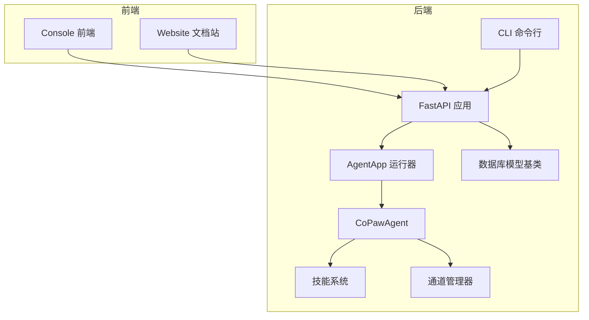
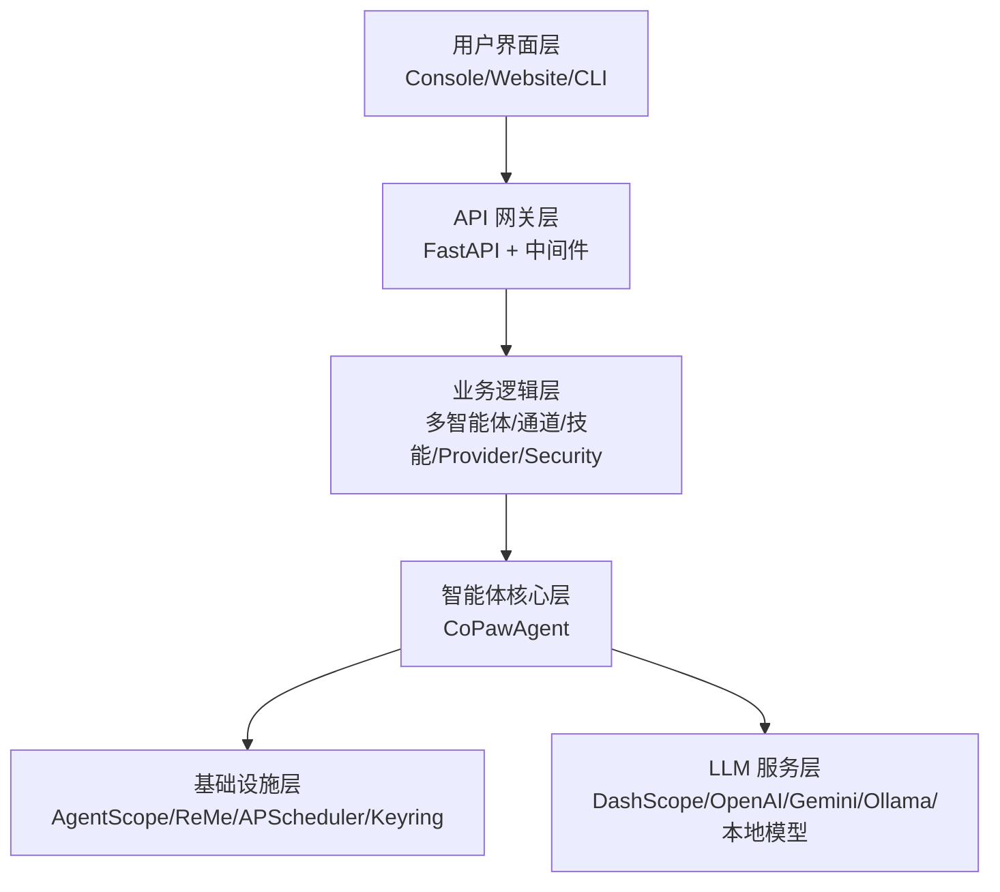
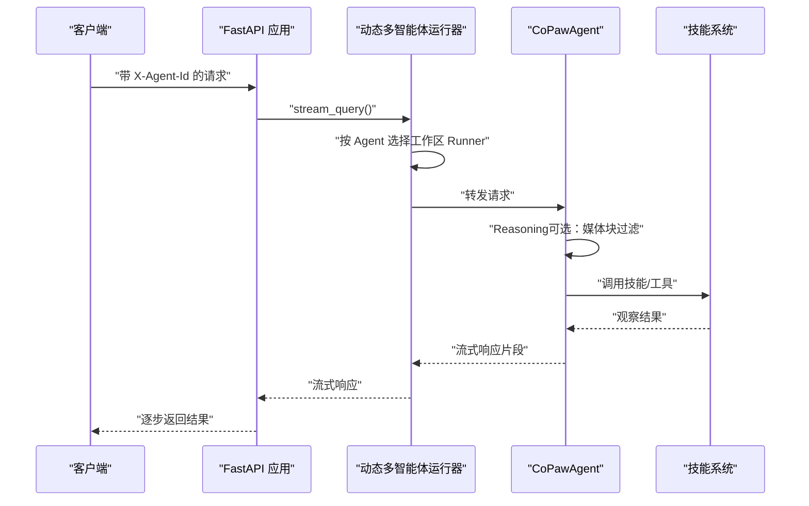
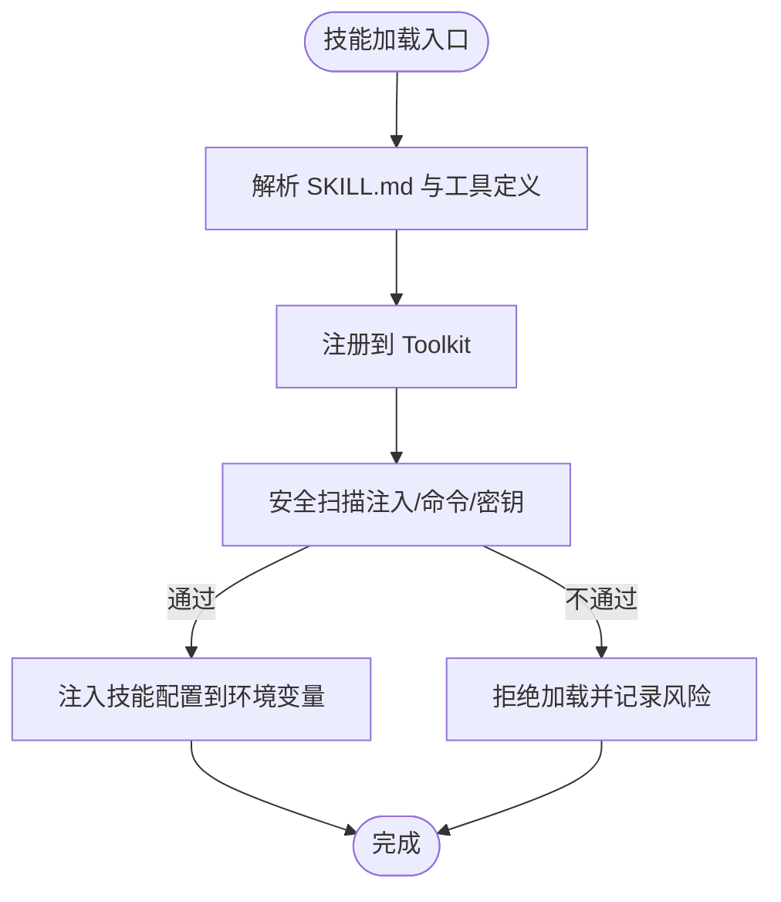
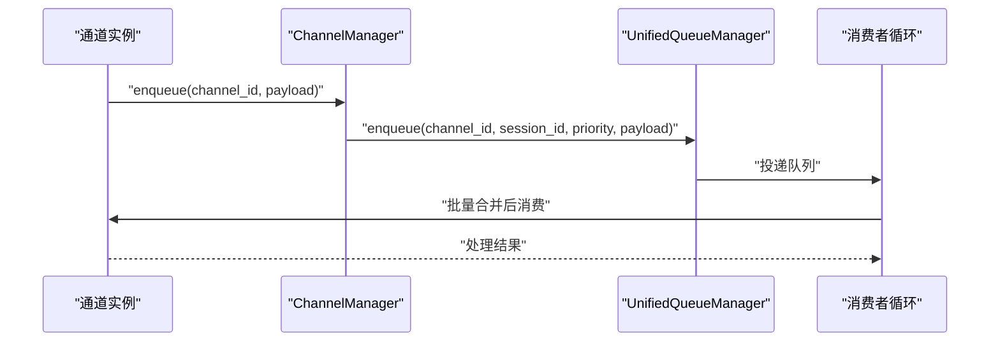
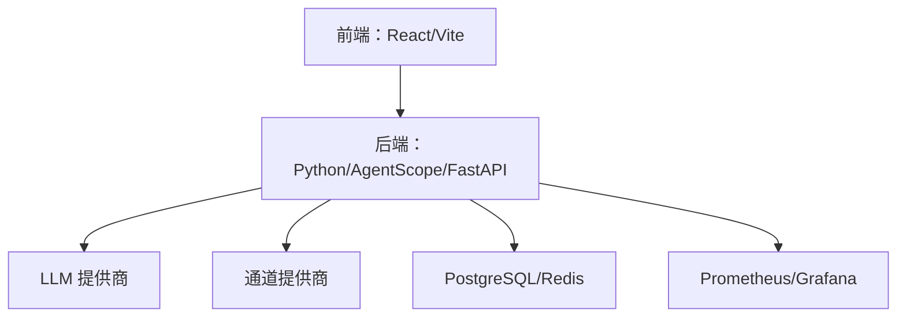

# 项目概述

<cite>
**本文引用的文件**
- [README.md](file://README.md)
- [Home.md](file://docs/wiki/Home.md)
- [Architecture.md](file://docs/wiki/Architecture.md)
- [QUICK-START.md](file://docs/QUICK-START.md)
- [ent-copaw.md](file://docs/ent-copaw.md)
- [__init__.py](file://src/copaw/__init__.py)
- [_app.py](file://src/copaw/app/_app.py)
- [constant.py](file://src/copaw/constant.py)
- [react_agent.py](file://src/copaw/agents/react_agent.py)
- [skills_manager.py](file://src/copaw/agents/skills_manager.py)
- [manager.py](file://src/copaw/app/channels/manager.py)
- [base.py](file://src/copaw/db/models/base.py)
- [main.py](file://src/copaw/cli/main.py)
</cite>

## 目录
1. [引言](#引言)
2. [项目结构](#项目结构)
3. [核心组件](#核心组件)
4. [架构总览](#架构总览)
5. [详细组件分析](#详细组件分析)
6. [依赖分析](#依赖分析)
7. [性能考量](#性能考量)
8. [故障排查指南](#故障排查指南)
9. [结论](#结论)
10. [附录](#附录)

## 引言
CoPaw 是一个面向个人与企业用户的智能助理系统，强调“由你掌控”的数据主权与隐私保护，支持本地或云端部署，提供多渠道接入、技能扩展、多智能体协作与多层次安全防护。项目基于 AgentScope 框架，采用 Python 后端 + React 前端架构，既适合个人日常效率提升，也可作为企业级平台进行团队协作、工作流编排与安全合规治理。

- 价值主张
  - 个人版：本地部署、可扩展技能、多渠道触达、安全可控
  - 企业版：多租户、RBAC、团队协作、审计与DLP、与Dify工作流集成

- 设计理念
  - 以 ReAct 推理范式为核心，结合工具调用与技能执行，形成“思考—行动—反馈”的闭环
  - 通过技能池与工作区分离，实现技能的可移植、可复制与可治理
  - 通道抽象统一消息入口，支持从 Console 到钉钉、飞书、Telegram 等多平台

- 核心能力
  - 多智能体协作：可创建多个独立 Agent，启用协作技能实现跨 Agent 协同
  - 技能扩展：内置技能池与工作区技能副本，支持扫描、签名与冲突处理
  - 多层安全：工具守卫、文件访问控制、技能安全扫描、凭证加密
  - 多渠道集成：统一通道管理与队列调度，支持批量合并与优先级处理
  - 企业特性：多租户、RBAC、审计日志、DLP、SSO、工作流编排

**章节来源**
- [README.md: 33-69:33-69](file://README.md#L33-L69)
- [Home.md: 19-31:19-31](file://docs/wiki/Home.md#L19-L31)
- [ent-copaw.md: 26-42:26-42](file://docs/ent-copaw.md#L26-L42)

## 项目结构
- 后端（Python）
  - 应用入口与生命周期：FastAPI 应用、动态多智能体运行器、企业中间件与监控
  - 智能体与推理：CoPawAgent（ReActAgent + 工具守卫 + 技能注册 + 记忆管理）
  - 通道系统：统一通道管理器、队列与优先级调度
  - 技能系统：技能池与工作区技能同步、签名与冲突处理、安全扫描
  - 数据与配置：常量与环境变量、数据库模型基类（多租户隔离）
  - CLI：Click 分组与懒加载命令

- 前端（React）
  - Console 控制台、Website 文档站点、国际化与主题切换、页面布局与组件

- 部署与运维
  - Docker 多阶段构建、Supervisord 管理、Prometheus 监控、Grafana 仪表盘

**图表来源**
- [_app.py: 475-685:475-685](file://src/copaw/app/_app.py#L475-L685)
- [react_agent.py: 69-183:69-183](file://src/copaw/agents/react_agent.py#L69-L183)
- [skills_manager.py: 119-148:119-148](file://src/copaw/agents/skills_manager.py#L119-L148)
- [manager.py: 68-107:68-107](file://src/copaw/app/channels/manager.py#L68-L107)
- [base.py: 19-76:19-76](file://src/copaw/db/models/base.py#L19-L76)
- [main.py: 95-142:95-142](file://src/copaw/cli/main.py#L95-L142)

**章节来源**
- [Home.md: 80-96:80-96](file://docs/wiki/Home.md#L80-L96)
- [Architecture.md: 7-74:7-74](file://docs/wiki/Architecture.md#L7-L74)

## 核心组件
- 应用入口与生命周期
  - FastAPI 应用初始化、CORS、认证中间件（单用户/企业）、静态资源与 SPA 路由回退
  - 动态多智能体运行器：按请求头选择 Agent 工作区，委托到对应 Runner
  - Prometheus 监控与自定义指标（按租户统计 API 请求）

- 智能体与推理
  - CoPawAgent：ReActAgent + 工具守卫 + 技能注册 + 记忆管理 + 命令处理
  - 系统提示构建：从工作区文件与环境上下文生成，支持多模态提示注入
  - MCP 客户端注册与恢复：支持 HTTP/STDIO 客户端，断连自动恢复

- 通道系统
  - ChannelManager：统一队列与消费者循环，支持批量合并、优先级分类、会话去抖
  - 命令注册与优先级：根据查询文本判定优先级，路由到统一队列

- 技能系统
  - 技能池与工作区技能：双层结构，支持签名、冲突处理、安全扫描
  - 环境变量注入：按需将技能配置映射为环境变量，支持受控释放

- 数据与配置
  - 常量与环境变量：工作目录、媒体目录、心跳、并发与限流、CORS、日志级别等
  - 数据库基类：UUID 主键、时间戳、软删除、多租户隔离字段

- CLI
  - Click Group 懒加载子命令，减少启动时延，统一版本与主机端口参数

**章节来源**
- [_app.py: 152-473:152-473](file://src/copaw/app/_app.py#L152-L473)
- [react_agent.py: 69-183:69-183](file://src/copaw/agents/react_agent.py#L69-L183)
- [manager.py: 68-107:68-107](file://src/copaw/app/channels/manager.py#L68-L107)
- [skills_manager.py: 119-148:119-148](file://src/copaw/agents/skills_manager.py#L119-L148)
- [constant.py: 72-274:72-274](file://src/copaw/constant.py#L72-L274)
- [base.py: 19-76:19-76](file://src/copaw/db/models/base.py#L19-L76)
- [main.py: 95-142:95-142](file://src/copaw/cli/main.py#L95-L142)

## 架构总览
CoPaw 采用分层架构：用户界面层（Console/Website/CLI）、API 网关层（FastAPI）、业务逻辑层（多智能体/通道/技能/Provider/Security）、智能体核心层（CoPawAgent）、基础设施层（AgentScope 运行时/ReMe/APSChduler/Keyring）、LLM 服务层（DashScope/OpenAI/Gemini/Ollama/本地模型）。

**图表来源**
- [Architecture.md: 7-74:7-74](file://docs/wiki/Architecture.md#L7-L74)
- [_app.py: 475-685:475-685](file://src/copaw/app/_app.py#L475-L685)

**章节来源**
- [Architecture.md: 78-158:78-158](file://docs/wiki/Architecture.md#L78-L158)

## 详细组件分析

### 组件A：多智能体协作与动态路由
- 动态多智能体运行器
  - 通过 X-Agent-Id 请求头选择 Agent 工作区，委托到对应 Runner
  - 支持流式查询与错误透传，便于前端渐进式渲染
- CoPawAgent
  - ReAct 循环：Reasoning → Action → Observation → Reasoning
  - 工具守卫拦截危险命令，文件访问控制与技能安全扫描
  - 记忆管理：自动压缩、语义检索、分层存储
  - 系统提示：从工作区文件构建，支持多模态提示注入

**图表来源**
- [_app.py: 60-136:60-136](file://src/copaw/app/_app.py#L60-L136)
- [react_agent.py: 665-774:665-774](file://src/copaw/agents/react_agent.py#L665-L774)

**章节来源**
- [_app.py: 60-136:60-136](file://src/copaw/app/_app.py#L60-L136)
- [react_agent.py: 69-183:69-183](file://src/copaw/agents/react_agent.py#L69-L183)

### 组件B：技能系统与安全扫描
- 技能池与工作区
  - 技能池：共享技能集合，内置签名与来源标记
  - 工作区：技能副本，支持按通道生效与环境变量注入
- 安全与治理
  - 签名与冲突处理：基于内容哈希，避免同名冲突
  - 安全扫描：提示词注入、命令注入、硬编码密钥检测
  - 环境变量注入：按需将技能配置映射为环境变量，受控释放

**图表来源**
- [skills_manager.py: 119-148:119-148](file://src/copaw/agents/skills_manager.py#L119-L148)
- [skills_manager.py: 666-711:666-711](file://src/copaw/agents/skills_manager.py#L666-L711)

**章节来源**
- [skills_manager.py: 119-148:119-148](file://src/copaw/agents/skills_manager.py#L119-L148)
- [skills_manager.py: 666-711:666-711](file://src/copaw/agents/skills_manager.py#L666-L711)

### 组件C：通道系统与统一队列
- 通道抽象
  - BaseChannel：统一 start/stop/send/receive 接口
  - 支持 DingTalk/Feishu/Telegram/WeChat 等多平台
- 统一队列与优先级
  - ChannelManager：统一队列、批量合并、优先级分类、会话去抖
  - CommandRegistry：根据查询文本判定优先级，路由到消费者循环

**图表来源**
- [manager.py: 68-107:68-107](file://src/copaw/app/channels/manager.py#L68-L107)
- [manager.py: 362-446:362-446](file://src/copaw/app/channels/manager.py#L362-L446)

**章节来源**
- [manager.py: 68-107:68-107](file://src/copaw/app/channels/manager.py#L68-L107)
- [manager.py: 362-446:362-446](file://src/copaw/app/channels/manager.py#L362-L446)

### 组件D：企业版功能与多租户
- 多租户与组织架构
  - 租户隔离：数据与资源隔离，支持 Schema 隔离等方案
  - 组织集成：LDAP/SAML/SCIM 与企业身份提供商集成
  - 用户与用户组：同步组织架构，灵活权限分配
- RBAC 与审计
  - 细粒度权限点：Agent/Skill/工作流/数据源/对话历史
  - 审计日志：结构化日志、不可篡改存储、合规导出
- DLP 与合规
  - 敏感数据识别与策略：脱敏/告警/阻断
  - 合规支持：数据驻留、被遗忘权、导出与报告
- 工作流编排（与 Dify 集成）
  - 双向赋能：CoPaw 作为 Dify 工具节点；Dify 作为 CoPaw 超级技能
  - 可视化与监控：连接器管理、触发与交互、Webhook 回调

**章节来源**
- [ent-copaw.md: 95-144:95-144](file://docs/ent-copaw.md#L95-L144)
- [ent-copaw.md: 111-130:111-130](file://docs/ent-copaw.md#L111-L130)
- [ent-copaw.md: 147-201:147-201](file://docs/ent-copaw.md#L147-L201)
- [ent-copaw.md: 203-234:203-234](file://docs/ent-copaw.md#L203-L234)

## 依赖分析
- 技术栈
  - 后端：Python 3.10–3.13、AgentScope、FastAPI、uvicorn、APScheduler、ReMe、Keyring、Playwright、httpx
  - 前端：React 18、TypeScript、Ant Design、Vite、Zustand、React Router、i18n
  - 部署：Docker 多阶段构建、Supervisord、Prometheus、Grafana
- 外部依赖与集成
  - LLM 提供商：DashScope、OpenAI、Gemini、Anthropic、SiliconFlow、Ollama、本地 llama.cpp
  - 通道提供商：DingTalk、Feishu、Telegram、Discord、WeChat、iMessage、Matrix、MQTT 等
  - 企业集成：PostgreSQL、Redis、Prometheus、Grafana、企业身份与合规系统

**图表来源**
- [Architecture.md: 401-426:401-426](file://docs/wiki/Architecture.md#L401-L426)
- [Home.md: 80-96:80-96](file://docs/wiki/Home.md#L80-L96)

**章节来源**
- [Architecture.md: 401-426:401-426](file://docs/wiki/Architecture.md#L401-L426)
- [Home.md: 80-96:80-96](file://docs/wiki/Home.md#L80-L96)

## 性能考量
- 模型调用优化
  - 速率限制（滑动窗口 QPM）、指数退避重试、流式响应、模型路由
- 记忆优化
  - 自动压缩、语义检索（ReMe）、分层存储（短期/长期）
- 并发处理
  - 全异步架构、HTTP 连接池、优先级队列

**章节来源**
- [Architecture.md: 315-335:315-335](file://docs/wiki/Architecture.md#L315-L335)

## 故障排查指南
- 常见问题
  - 端口占用：更换端口或停止占用进程
  - 数据库连接失败：检查 PostgreSQL/Redis 是否运行与可达
  - 本地模型无法启动：确认下载与路径配置正确
- 诊断建议
  - 查看应用日志与启动耗时（CLI 初始化计时）
  - 检查通道队列堆积与消费者状态
  - 核对技能签名与冲突、安全扫描结果

**章节来源**
- [QUICK-START.md: 309-337:309-337](file://docs/QUICK-START.md#L309-L337)
- [main.py: 52-56:52-56](file://src/copaw/cli/main.py#L52-L56)

## 结论
CoPaw 以 ReAct 推理为核心，结合工具守卫与技能系统，构建了从个人助理到企业平台的完整能力谱系。个人版强调“由你掌控”的隐私与可扩展性，企业版则在多租户、RBAC、审计与DLP、工作流编排等方面补齐企业级能力缺口。通过统一通道与队列、可观测性与安全扫描，CoPaw 既能满足个人高效日常，也能支撑企业级团队协作与合规运营。

## 附录

### 个人版与企业版功能对比
- 个人版
  - 本地部署、单用户、技能池与工作区技能、工具守卫、文件访问控制、技能安全扫描
- 企业版
  - 多租户、组织架构与SSO、RBAC、审计日志、DLP、工作流编排（Dify）、监控与告警

**章节来源**
- [README.md: 176-253:176-253](file://README.md#L176-L253)
- [ent-copaw.md: 95-144:95-144](file://docs/ent-copaw.md#L95-L144)

### 部署方式与适用场景
- 部署方式
  - pip 安装（个人）、Docker（单机/容器化）、桌面应用（Beta）、脚本安装
- 适用场景
  - 个人：社交/生产力/创意/研究/文件管理
  - 企业：团队协作、工作流自动化、数据安全与合规、IT/HR/财务/销售等职能自动化

**章节来源**
- [QUICK-START.md: 7-16:7-16](file://docs/QUICK-START.md#L7-L16)
- [README.md: 113-155:113-155](file://README.md#L113-L155)

### 发展历程与未来规划
- 版本演进
  - v1.0.2：插件系统、CLI 任务执行、多模态本地模型、敏感凭证加密、技能标签
- 未来规划
  - 多模态增强、语音/视频通话、大小模型协同、云原生集成、技能生态建设

**章节来源**
- [README.md: 73-82:73-82](file://README.md#L73-L82)
- [Architecture.md: 438-447:438-447](file://docs/wiki/Architecture.md#L438-L447)